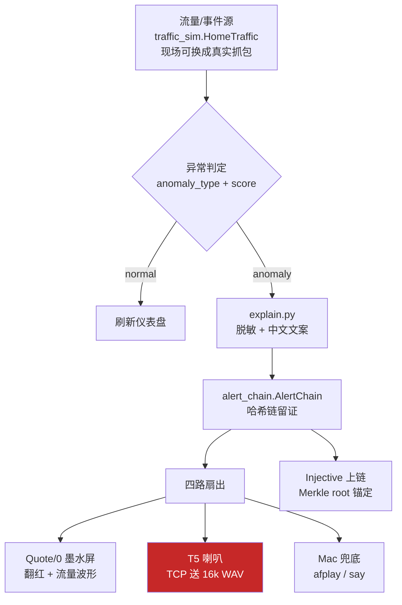

# T5 接入架构 —— 从异常检测到板子出声

> 状态：2026-07-25 实测。T5 在 `10.64.3.39:9000`，已能播放告警语音。
> 本文只记录**实测验证过**的行为；推断和未验证的部分都会明确标注。

---

## 0. 先说一个必须知道的矛盾

仓库里存在**两套 T5 传输设计**，它们互不兼容，当前跑的是其中一套：

| | 设计 A：签名信封 | 设计 B：裸音频流 ← **当前实际在跑** |
|---|---|---|
| 代码 | `t5_wifi_bridge.py` + `ditto_alert.py` | `send_wav.py` |
| 端口 | WebSocket `18789` | TCP `9000` |
| 传什么 | 签名后的 JSON 告警（T5 端 TTS/播预置音） | 16kHz WAV 音频字节流 |
| 安全性 | ECDSA P-256 验签，fail-closed | **无任何认证** |
| 板子固件 | TuyaOpen + TuyaOpenClaw | Arduino TCP 播放器 |

**当前板子上烧的是设计 B 的固件。** 实测证据：`9000` 端口开放并走完 `TWAV` 协议；
串口拔掉后仍工作；早先串口里的 TuyaOpen CLI（`tuya>`）已不存在。

这意味着 **`ditto_alert.py` 的整套签名机制目前是绕过的** ——
同一网段任何人都能往 `9000` 端口推任意音频让板子播。
路演环境可接受；作为「安全哨兵」产品对外讲，这一点必须要么修、要么诚实说明。
修复方案见 §6。

---

## 1. 连接 T5

### 物理与网络

| 项 | 值 | 说明 |
|---|---|---|
| 型号 | 涂鸦 T5AI-Core（T5-E1 模组） | 板载麦克风 + 喇叭 |
| MAC | `00:33:7a:cd:58:23` | **换网后靠它在路由器 DHCP 表里认设备** |
| IP | `10.64.3.39` | DHCP 分配，**换网络必变，不要写死** |
| 音频端口 | TCP `9000` | 当前固件的 WAV 接收口 |
| 串口 | `/dev/cu.wchusbserial*` @115200 | 当前固件下不提供命令行 |
| Wi-Fi | **仅 2.4GHz** | 不支持 5G，热点要开兼容模式 |

### 换网络后怎么找到它

IP 不在固件里，是 DHCP 给的。换网后按顺序试：

1. 路由器后台 DHCP 客户端列表，找 MAC `00:33:7a:cd:58:23`
2. 扫网段：`for i in $(seq 1 254); do (nc -z -G 1 -w 1 10.64.x.$i 9000 && echo $i) & done; wait`
3. 插 USB 看启动日志（若固件会打印 IP）

> ⚠ **`ping` 通不代表服务活着。** ICMP 由内核回，应用崩了照样通。
> 判断服务是否可用只能用 `nc -vz <ip> 9000`。这个坑实测踩过。

---

## 2. T5 的 Input / Output

### Input —— 板子接收什么

**唯一入口：TCP `9000`，`TWAV` 协议**（实测确认）

```
Client                          T5
  │                              │
  ├─ "TWAV" + uint32_BE(len) ───▶│   8 字节定长头
  │◀────────────── "READY\n" ────┤   板子准备好接收
  ├─ <WAV 文件原始字节> ─────────▶│   len 字节
  │◀─────────── "RECEIVED\n" ────┤   收全了
  │◀──────────── "PLAYING\n" ────┤   开始播
  │◀────────────── "DONE\n" ─────┤   播完，连接关闭
```

失败时返回 `ERROR...\n`。协议实现见 `send_wav.py`。

**音频格式要求（硬性，实测验证）**

| 参数 | 必须值 |
|---|---|
| 容器 | RIFF/WAVE |
| 采样率 | **16000 Hz** |
| 位深 | 16 bit |
| 声道 | 单声道 |

> **48kHz 会让板子崩溃重启。** 对照实验：
> | 文件 | 采样率 | 大小 | 结果 |
> |---|---|---|---|
> | short_16k.wav | 16000 | 97KB | `DONE` ✓ |
> | audio_16k.wav | 16000 | 685KB | `DONE` ✓ |
> | xiaoxiao.wav | **48000** | 2043KB | `RECEIVED` 后连接重置 ✗ |
>
> 685KB 的 16k 文件（与 48k 版同样 21.8 秒内容）完整播完，
> **证明不是大小/内存问题，是采样率**。板子停在 `RECEIVED` 崩溃，
> 说明 codec 按 16k 初始化，喂 48k 数据越界。

转换命令（macOS 自带，无需装东西）：

```bash
afconvert -f WAVE -d LEI16@16000 -c 1 输入.wav 输出_16k.wav
```

### Output —— 板子返回什么

只有上面协议里那 4 个状态字符串。**没有** ACK 签名、没有播放结果回执、
没有设备健康度上报。想知道"到底响了没"，目前只能靠 `DONE` + 人耳。

---

## 3. 检测 → T5 的完整链路



### 各层职责与实际文件

| 层 | 文件 | 输入 | 输出 |
|---|---|---|---|
| 事件源 | `traffic_sim.py` | 设备 id / 攻击类型 / 分数 | 每设备吞吐 + 时序 `history` |
| 文案 | `explain.py` | `device_id, anomaly_type, score` | 中文播报句（已脱敏） |
| 留证 | `alert_chain.py` | 告警记录 | 哈希链 + Merkle root |
| 签名 | `ditto_alert.py` | 告警 dict | ECDSA P-256 签名信封 |
| 墨水屏 | `mindreset_quote.py` / `quote_image.py` | snapshot | Image/Canvas/Text 三层 |
| T5 | `send_wav.py`（当前） | 16k WAV | 板子出声 |
| Mac | `voice_alert.py` | clip_key | `afplay` mp3 / `say` 兜底 |

### 脱敏边界（贯穿全链）

`explain.py` 的 `_DEVICE_ALIAS` 把 `smart-camera-01` 归一成「摄像头01」，
只暴露**类别 + 序号**。全链路（屏幕 / 语音 / 上链）都用这一份映射，
绝不外发真实 IP、拓扑、身份、原始流量。

---

## 4. 音频资产

文案不硬编码，全部由 `explain.py` 生成 —— 屏幕、语音、Quote/0 说同一套话。

```bash
.venv/bin/python tools/gen_voice_clips.py --force --pcm
```

| clip | 触发 | 产物 |
|---|---|---|
| `spying` | 温控器被监听 | `.mp3`（Mac）+ `.16k.wav`（T5） |
| `malicious_control` | 门锁被控 | 同上 |
| `dos` | 摄像头被劫持 | 同上 |
| `evidence_sealed` | 上链收尾 | 同上 |
| `normal` / `offline` | 状态屏 | 同上 |

TTS 用 **edge-tts**（免费、零 API key），音色 `zh-CN-YunyangNeural`（男声新闻腔）。
换音色改 `tools/gen_voice_clips.py` 顶部一行 `VOICE` 再 `--force` 重跑即可。

---

## 5. 当前缺口

### ⚠ 缺口 1：`demo.py` 里 T5 那一路是断的

`demo.py` 调的是 `t5.speak_anomaly(clip, sev)`（`t5_bridge.py`，**走串口发 clip 键**），
而板子现在跑 TCP 播放器固件，**收不到串口命令**。

**后果：告警发生时 Quote/0 会翻红、Mac 会出声，但 T5 不会响。**

修法：把 `t5_bridge` 换成 TCP 送 wav（见 §6 的 `t5_tcp.py`）。

### ⚠ 缺口 2：签名机制被绕过

`ditto_alert.py` 的 ECDSA 验签在当前固件下完全没用上。
同网段任何人可推任意音频到 `9000`。

### ⚠ 缺口 3：没有 ACK / 健康检查

板子不上报状态。它掉线、崩溃、没连上网，上位机都不知道，
只有下次推送超时才发现。

---

## 6. 建议的下一步

**① 补一个 `t5_tcp.py`**（最小改动打通链路）

```python
def speak_wav(path: str, host: str = "", timeout: float = 90) -> bool:
    """把 16k WAV 送到 T5 播放。失败返回 False，绝不抛异常——
    T5 哑了不能影响检测主链（与 voice_alert / mindreset_quote 同约定）。"""
```

接口与 `t5_bridge.speak_anomaly` 保持一致，`demo.py` 改一行 import 即可。
需内置：采样率预检（非 16k 直接拒发，避免把板子搞崩）、
重连等待（板子崩溃重启需 ~15s）、失败降级到 Mac 语音。

**② 采样率守卫**

`send_wav.py` 目前会把任何 RIFF 送出去。加一道检查：
不是 16kHz/单声道就拒绝并打印转换命令。现场随手抓个文件就能把板子搞挂。

**③ 若要恢复签名链**

需要板子固件在播放前验签。当前 Arduino 固件没有这个能力，
要么改固件、要么退回设计 A（TuyaOpen + TuyaOpenClaw + WebSocket 18789）。
这是产品叙事和工程现实之间的取舍，**建议现在明确选一边并在 pitch 里诚实表述**。

---

## 附：故障速查

| 现象 | 原因 | 处理 |
|---|---|---|
| `ConnectionRefused` | 板子正在重启 | 等 ~15s 重试 |
| `TimeoutError` | 不在同一网段 / 板子没连网 | 查 IP，`nc -vz ip 9000` |
| `READY`→`RECEIVED`→重置 | **采样率不是 16k** | `afconvert` 转换 |
| ping 通但没声音 | 应用崩了，内核还在回 ICMP | 用 `nc -vz` 判断，别信 ping |
| 播放变速/杂音 | 采样率或声道不对 | 转 16kHz 单声道 |
